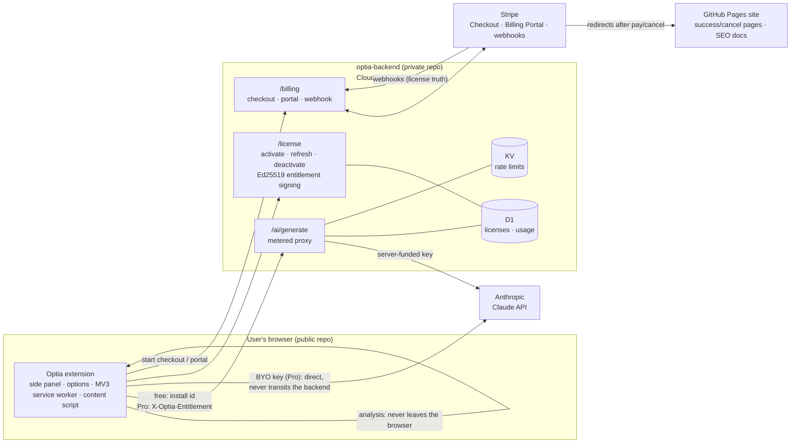

# Freemium Architecture & the Open-Core Split

How Optia's freemium model works, which parts are public and which are private,
and why a modified client can never grant itself Pro. Written for contributors
to this repo and as the reference for the security model.

Related docs: [free-vs-pro-gating.md](free-vs-pro-gating.md) (which features
are gated and by which flag) · the private backend's own README (setup,
deploys, operations).

## The two repositories

Optia is **open-core**. The split is by trust, not by convenience:

| | Public — [`PMDevSolutions/Optia`](https://github.com/PMDevSolutions/Optia) (this repo) | Private — [`PMDevSolutions/optia-backend`](https://github.com/PMDevSolutions/optia-backend) |
|---|---|---|
| Ships | The Chrome extension (`app/`), the GitHub Pages site (`site/`, incl. the SEO docs and checkout redirect pages), all docs and tooling | A Cloudflare Worker (Hono) serving `api.optia-api.com` (production) and a staging host |
| SEO analysis & scoring | ✅ Entirely client-side, free, unlimited | — |
| Licensing | The **client** half: entitlement verification, caching, refresh, the paywall/account UI, checkout *initiation* | The **authority** half: license minting, Ed25519 **signing** (private key), seat activation, revocation |
| Billing | Opens Checkout/portal URLs the backend returns | Stripe integration: Checkout session creation (price allowlist), Billing Portal, webhook ingestion — webhooks are the source of truth for license state |
| AI | The routing facade (`app/src/lib/ai.ts`) and the BYO-key direct path | The hosted AI proxy `/ai/generate`: server-funded Anthropic key, per-subject metering (D1), rate limiting (KV), per-check prompts |
| Secrets | **None.** Public verification keys only | Anthropic API key, Stripe secret + webhook secret, the entitlement signing JWK |

The extension's full gating logic is public on purpose. Hiding it would add
nothing: gates are client-side UX, and everything worth paying for is enforced
server-side (see the trust boundary below). Security here does not depend on
obscurity.

## System diagram

Notes the diagram can't carry:

- **SEO analysis is fully local.** Scoring never sends the page anywhere.
- **BYO-key requests never touch the backend** — the proxy deliberately ignores
  any `Authorization` header, so user keys cannot transit our infrastructure
  even by accident.
- Hosted AI goes extension → backend proxy → **Anthropic** (the AI provider is
  Anthropic everywhere; there is no OpenAI in this system).

## The trust boundary: why the client cannot mint Pro

Pro status is a signed claim, not client state:

1. **Only the server can sign.** After Stripe's webhook confirms payment, the
   backend mints a license and issues an **entitlement**: an EdDSA (Ed25519)
   JWS with `iss: optia-backend`, `aud: optia-extension`, the tier, quota
   limit, accounting period, and a **24-hour expiry** (never beyond the paid
   period's end). The private signing JWK exists only as a Worker secret in the
   private repo's deployment.
2. **The client can only verify.** The extension bundles the *public* JWK
   (`app/src/lib/entitlement-keys.ts`) and verifies signature, issuer,
   audience, algorithm, and expiry (`app/src/lib/entitlement.ts`). Anything
   that fails verification — tampered, expired, wrong key, hand-rolled —
   resolves to the free tier. There is no code path that grants Pro without a
   verifying token.
3. **The server never trusts the client's word.** Pro-tier proxy calls present
   the raw entitlement (`X-Optia-Entitlement`) and the backend re-verifies it
   before metering against the license. A forged token gets a 401, with no
   fallback to free metering (fail closed).
4. **Everything scarce is metered server-side.** Monthly AI quotas are reserved
   atomically in D1 before the upstream call (refunded on upstream failure) and
   rate limits live in KV. The client's quota display is a cache of what the
   server reports — reconciled conservatively, never authoritative.
5. **Checkout can't be steered.** The backend only creates Stripe sessions for
   an allowlisted set of price ids, so a modified client cannot check out an
   attacker-priced product.

What a modified client *can* do: flip its own local UI gates (advanced fields,
language selector). What it gets: nothing metered or paid — hosted AI stays
capped per install, Pro proxy calls still need a validly signed entitlement,
and BYOK still requires the user's own Anthropic key. That asymmetry is the
entire point of the split.

## Verification keys: bundling and rotation

- **Per-environment key pairs.** Staging and production have separate signing
  keys; the extension bundles the matching public JWK at build time via Vite
  mode (`entitlement-keys.ts`). A staging token can never verify in a
  production build, and vice versa.
- **`kid`-pinned verification.** Tokens carry the signing key's `kid`; the
  client verifies only with a bundled JWK whose `kid` matches. An unknown `kid`
  fails verification — which is the rotation signal, not an error.
- **JWKS array for overlap.** `ENTITLEMENT_JWKS` is an array precisely so two
  public keys can ship side by side during a rotation.
- **Serve-time truth.** `GET /license/public-key` on each environment returns
  the currently active public key for auditing/debugging.

**Rotation runbook** (order matters — verifiers before signers):

1. Generate the new key pair (backend repo: `pnpm keys:generate`).
2. Add the new **public** JWK to `ENTITLEMENT_JWKS` alongside the old one and
   release the extension update.
3. Once that build is widely deployed, switch the backend's signing secret to
   the new private JWK.
4. Keep the old public key bundled for at least one token lifetime (24h) plus
   the refresh window; clients holding old-signed tokens refresh into
   new-signed ones automatically.
5. Remove the old JWK from the array in a later release.

If the private key is ever compromised: rotate the signer immediately (step 3
first) — old tokens die within 24h on their own, and revocation lists are
unnecessary because verification is `kid`-pinned once the old public key is
dropped from the bundle.

## Contributor rules (public repo)

- **Never add server-side paid logic or secrets here.** No Stripe keys, no
  Anthropic keys, no signing keys, no webhook handlers, no license minting. If
  a change needs any of those, it belongs in the private backend repo.
- The two public JWKs in `entitlement-keys.ts` are public **by design** — they
  can verify entitlements, never create them. Don't "fix" that.
- Client-side gates are UX, not security. It's fine that they're readable;
  it's not fine to make a server behavior depend on the client's honesty.
- AI prompt logic exists in both repos on purpose: the BYO-key direct path
  (`anthropic.ts`, here) and the hosted proxy (backend) must stay in sync so
  both paths produce the same shape of output. When you change one, mirror the
  other.

## Environments

| | Extension build | Backend host | Stripe |
|---|---|---|---|
| Production | `pnpm build` (Vite mode `production`) | `https://api.optia-api.com` | Live mode |
| Staging / dev | `vite build --mode staging` | `optia-backend-staging.…workers.dev` | "Optia Sandbox" (test cards) |

The backend repo's README covers its own setup: Wrangler environments, D1
migrations, secrets, and the deploy commands (`pnpm deploy:staging`,
`pnpm deploy:production`).
